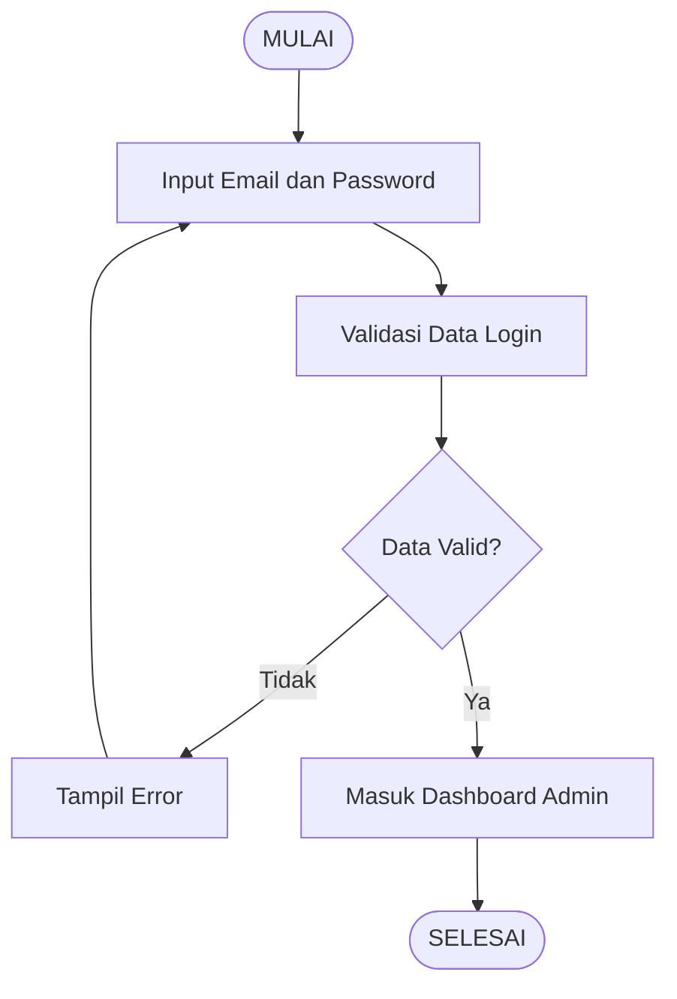
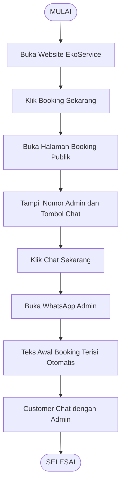
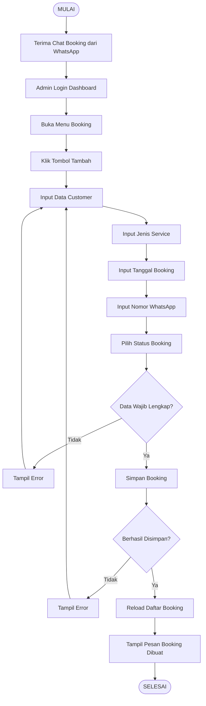
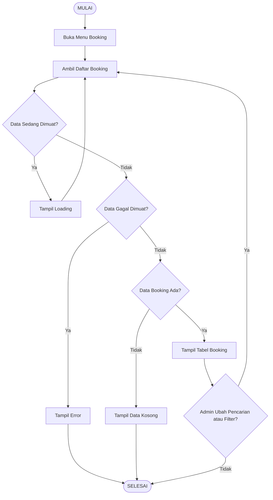
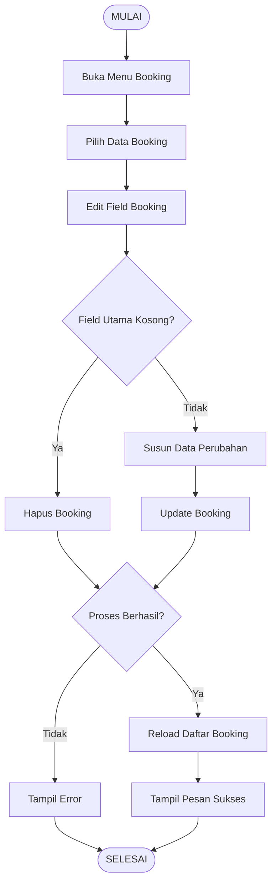
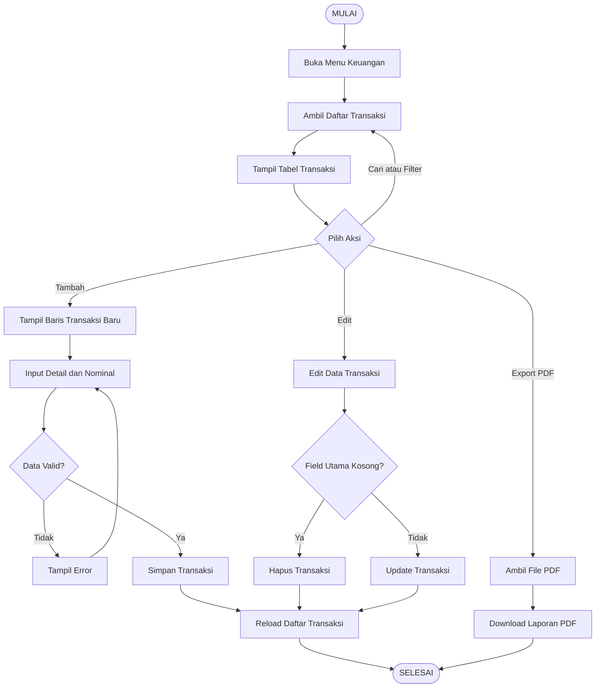
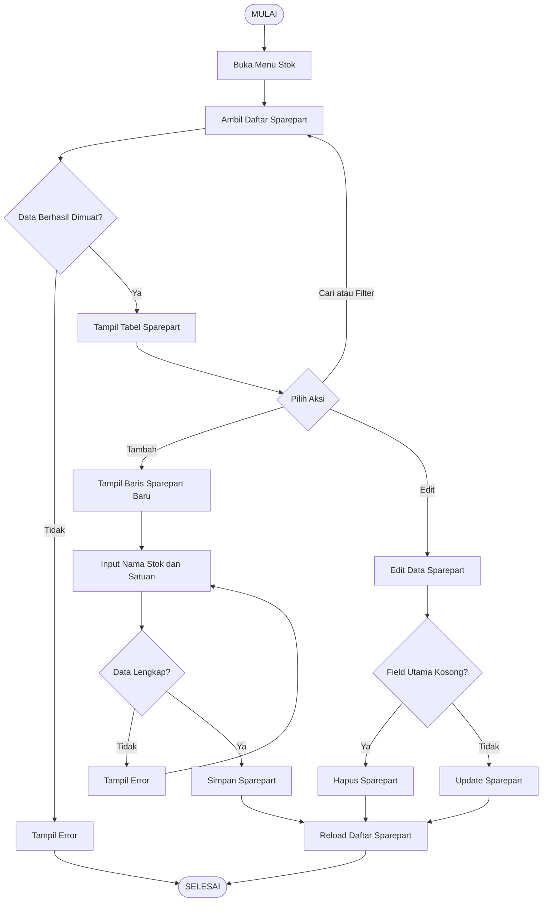
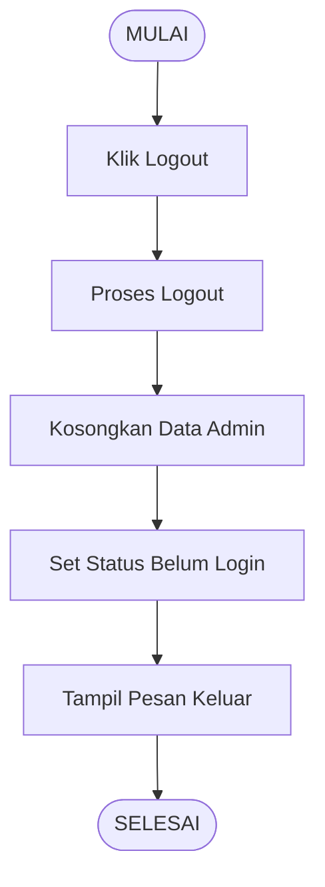

# Flowchart Frontend EkoService

Dokumen ini memakai gaya flowchart klasik seperti contoh: `Mulai` dan `Selesai` sebagai terminal, proses sebagai kotak, dan kondisi sebagai decision.

Saat menyalin ke Mermaid editor, copy isi di dalam blok diagram saja, mulai dari `flowchart TD`.

## Flow Login Admin

## Flow Customer Booking via WhatsApp

## Flow Admin Mencatat Booking

## Flow Cari dan Filter Booking

## Flow Edit atau Hapus Booking

## Flow Keuangan

## Flow Stok Sparepart

## Flow Logout Admin

