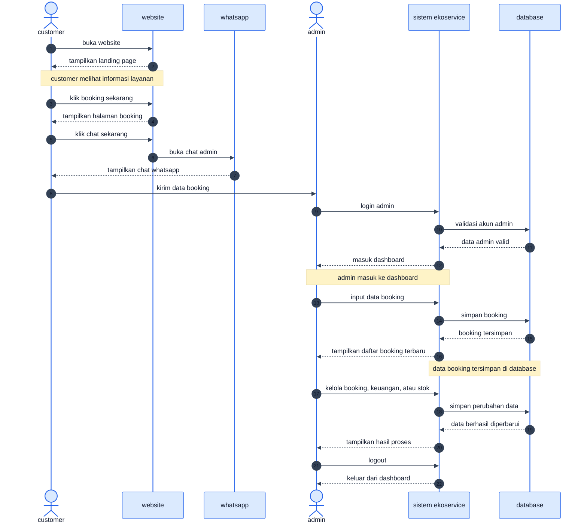

# sequence diagram ekoservice

diagram ini dibuat sederhana: customer booking lewat whatsapp, lalu admin mencatat dan mengelola data di sistem.

saat menyalin ke mermaid editor, copy isi di dalam blok diagram saja, mulai dari `sequenceDiagram`.

## sequence diagram utama

