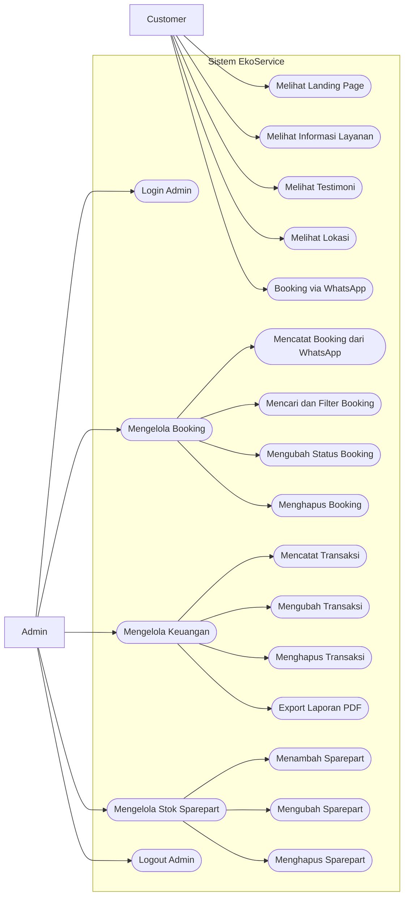

# Use Case Diagram EkoService

Dokumen ini menggambarkan aktor dan fitur utama pada frontend EkoService. Customer hanya melakukan booking lewat WhatsApp. Admin mengelola data dari dashboard.

Saat menyalin ke Mermaid editor, copy isi di dalam blok diagram saja, mulai dari `flowchart LR`.

## Use Case Diagram

